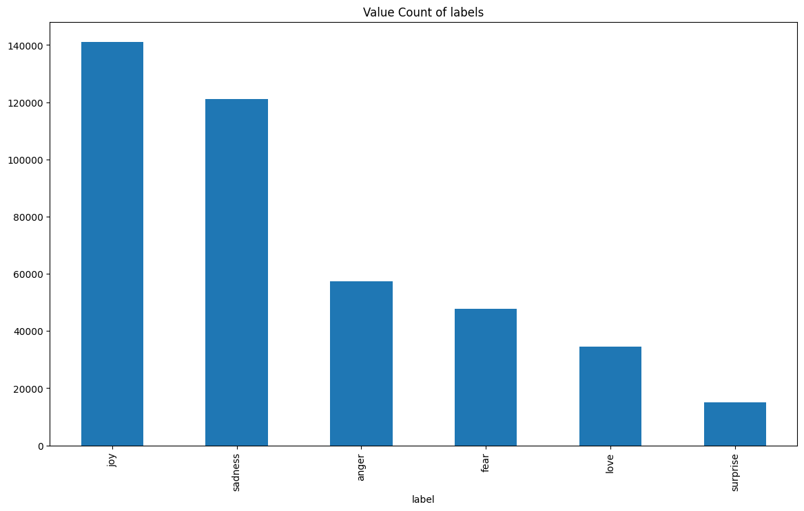
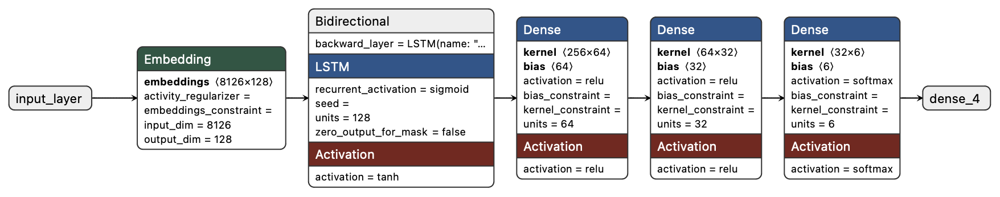

# Emotion Classification from Text

## Description
This project aims to classify text into specific emotions, such as "happy", "sad" or "anger" using deep learning techniques. The system takes a text input and predicts the corresponding emotion, enabling applications in sentiment analysis, chatbots, and mental health monitoring. 

The model leverages a Long Short-Term Memory (LSTM) neural network to analyze text data and classify the underlying emotions effectively.

---

## Data Description
The dataset used in this project contains two columns:
- `text`: A string representing user input, such as sentences or phrases.
- `label`: The emotion associated with the text (e.g., "happy," "sad," "anger").

### Example of the Dataset:
| Text                                | Label  |
|-------------------------------------|--------|
| "I am so excited for the weekend!" | happy  |
| "I feel very frustrated today."    | anger  |
| "Life has been really tough lately." | sad   |

---

## Data Exploration
Key steps in understanding the dataset include:
- **Text Length Analysis:** The distribution of text lengths was analyzed to determine an appropriate `max_sequence_length`.

    

- **Vocabulary Coverage:** A cumulative coverage analysis was performed to decide the `max_vocab_size`, ensuring sufficient representation of frequent words.

    

- **Label Distribution:** The dataset was inspected for label imbalance, ensuring adequate representation of all emotions.

    

---

## Data Preprocessing
To prepare the data for training, the following steps were performed:
1. **Text Cleaning:** 
   - Lowercased all text.
   - Removed punctuation, stopwords, and unnecessary characters.
2. **Tokenization:**
   - Converted text into sequences of integers using a tokenizer.
   - Limited the vocabulary size to the most frequent words ***showing in the previous graph*** (`max_vocab_size = 8,126`).
3. **Padding:**
   - Adjusted all sequences to a uniform length ***showing in the previous graph*** (`max_sequence_length = 80`) using post-padding.
4. **Label Encoding:**
   - Converted string labels into integers using `LabelEncoder`.
   - Applied one-hot encoding for multi-class classification.

---

## Model 

    

in order to get this model architecture representation you can load the `model-V2.h5` file in [Netron](https://netron.app) website 

The model architecture includes:
1. **Embedding Layer:**
   - Converts word indices into dense vectors of fixed size (`embedding_dim = 128`).
2. **Bidirectional LSTM Layer:**
   - Captures contextual information from both past and future words (`units = 64`).
3. **Dense Layers:**
   - Includes a fully connected layer with ReLU activation for feature extraction.
   - Dropout layers were added to prevent overfitting.
4. **Output Layer:**
   - Uses a softmax activation function to predict probabilities for each emotion class.

**Results:**

After the training, we passed the testing data to the the model to predict the labels and then we calculated the loss and accuracy and we got these results:
- **Acuracy:** 0.94
- **Loss:** 0.09

---
## Challenges and Improvements

During the development of the emotion classification model, we encountered several challenges. Here’s a summary of the issues faced and the improvements implemented to address them:

### 1. **Underfitting in the Initial Model**
- **Problem:** The first version of the model was underfitting the training data, failing to capture the patterns necessary for accurate emotion classification.
- **Solution:** 
  - Added more layers to increase the model's capacity.
  - Increased the number of neurons in the dense and LSTM layers to allow the model to learn more complex features.

### 2. **Prediction Mismatch with Training Data**
- **Problem:** When passing the training data through the model to predict labels, the predictions did not align with the `y_train` labels, indicating an issue with the data or model.
- **Solution:** 
  - Refined the preprocessing steps to ensure consistency between the training and prediction pipelines.
  - Adjusted the model's input layer parameters by:
    - Setting an appropriate `max_vocab_size` based on word frequency analysis.
    - Configuring the `max_sequence_length` to cover most text lengths in the dataset.

---
## Technologies Used
- **Data Manipulation:**  
    
    

- **Data Visualization:**  
    

- **Machine Learning Tools:**  
    

- **Deep Learning Framework:**  
    

